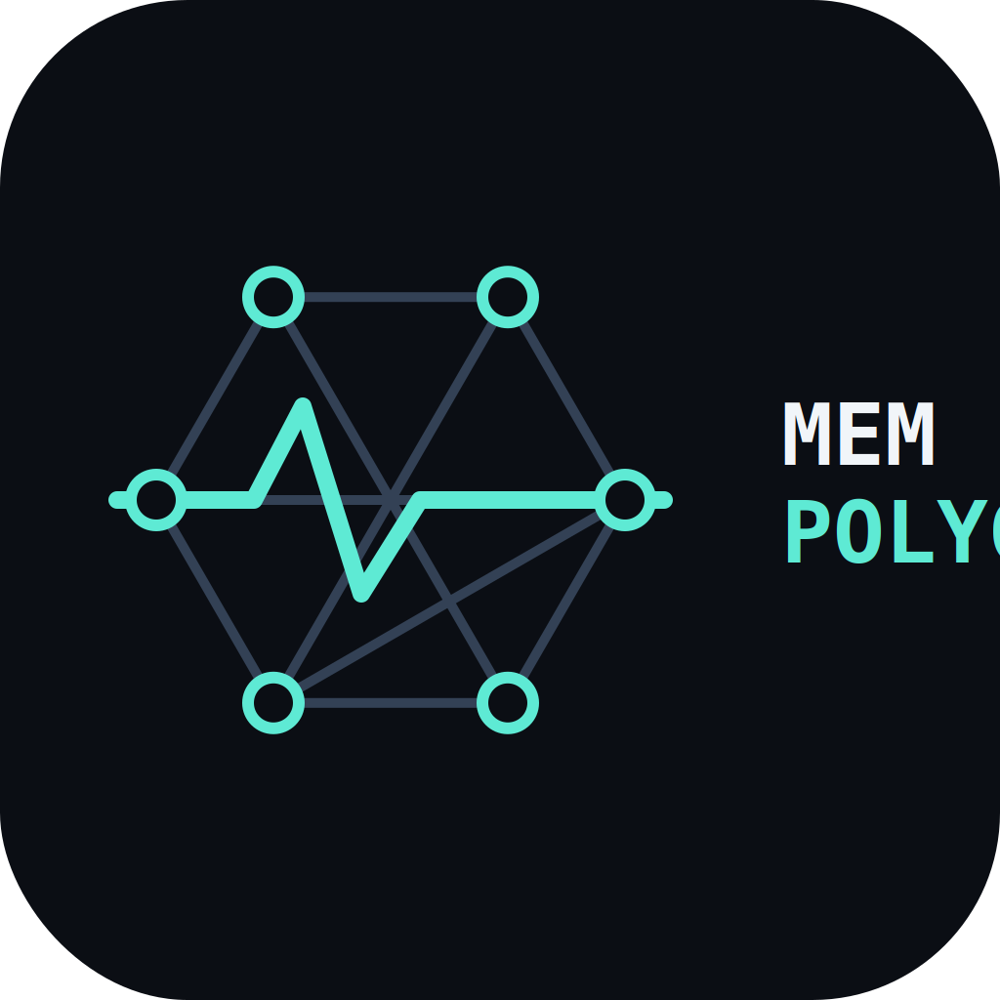

# MemPolygraph — verifiable memory-quality passports for AI agents



> Keycard certifies *who* an agent is. MemPolygraph certifies *whether its memory tells the truth* — with reproducible proof.
> Built for Colosseum Crypto World's Fair (Solana track).

## What it does
Point MemPolygraph at any agent memory store through a tiny black-box interface.
It runs a fixed eval battery — recall, abstention on unanswerables, adversarial negatives —
and issues a signed-style passport: score breakdown + SHA-256 fingerprint. No engine source needed, ever.

## Quick start
```bash
./scripts/setup.sh
python -m src.eval_harness --memories fixtures/synthetic_memories.json --eval fixtures/eval_set.json
python -m src.passport_generator --results evidence/last_run.json --out evidence/example_passport.json
```
Or one command with Docker (builds, runs the eval, prints the passport):
```bash
docker build -t mempolygraph . && docker run --rm mempolygraph
```

## 🎬 Videos (narrated by Synapse, EN subtitles burned in)
- **Pitch (2:13)** — [YouTube](https://youtu.be/XxnkcTs0n4Q) · [repo file](demo/pitch_final.mp4)
- **Live demo (1:12)** — [YouTube](https://youtu.be/60Gw710c8lc) · [repo file](demo/demo_final.mp4)
- **Weekly W2 (0:57)** — [YouTube](https://youtu.be/siaBhMz3Nio) · [repo file](demo/weekly_final.mp4)

## Track record (linked, not copied)
- [`k3-trust-validation`](https://github.com/marcot3ssar1/k3-trust-validation) — eval harness pattern + methodology that scored 71.87 → 90.0 Elder on a live registry
- [`synapse-evidence`](https://github.com/marcot3ssar1/synapse-evidence) — capability docs + redacted evidence

## Security
See [SECURITY.md](SECURITY.md). In short: no engine internals, prompts, keys, tokens, or raw memories are ever committed here.

## Verified 28/09 (WSL Ubuntu 22.04, Python 3.14 venv, Docker 29.8.1)
- venv: harness PASS (recall 0.875, abstain 1.0, adv 1.0, deterministic), passport accuracy 0.925.
- docker build + run: prints valid passport, gate_pass true. Fingerprint independently recomputable.

